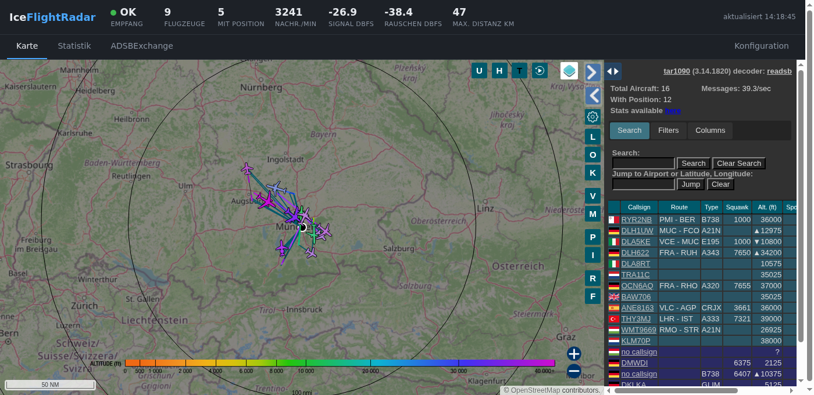
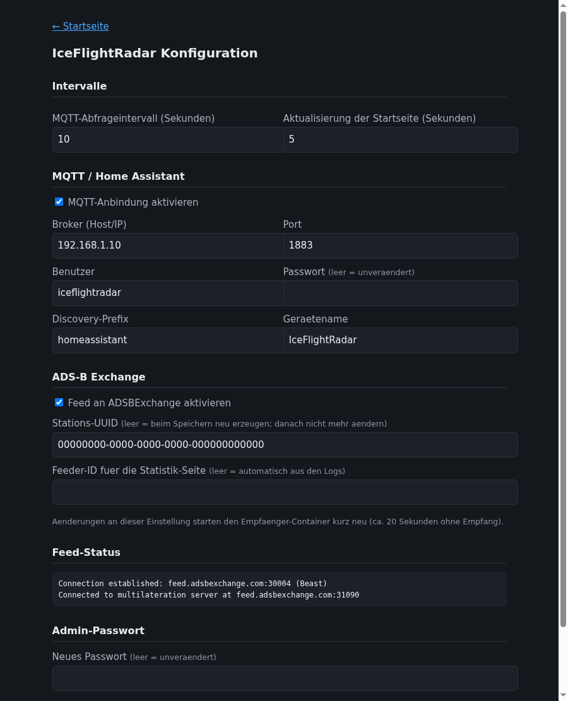

# IceFlightRadar

Eigener ADS-B-Flugradar: Ein RTL-SDR-Stick empfängt die 1090-MHz-Signale der Flugzeuge, `readsb` dekodiert sie, `tar1090` zeigt sie als interaktive Radar-Karte (Positionen, Rufzeichen, Höhe, Speed, Routen, Trails). Das Projekt läuft **mit oder ohne Home Assistant** und zeigt in beiden Fällen dieselben Werte und Oberflächen:

- **Standalone:** Weboberfläche auf Port 80 mit Karte, Statistik, Live-Werten und einer Konfigseite (kein Home Assistant nötig).
- **Mit Home Assistant:** Dashboard **FlightRadar** und die Werte als MQTT-Entitäten (per Auto-Discovery).
- **Als Appliance auf einem Raspberry Pi:** WLAN-Einrichtung per Access Point, wenn noch kein WLAN konfiguriert ist.
- Optional: Feed an ADSBExchange.

## Screenshots

**Standalone-Startseite** (Karte, Statistik und ADSBExchange als Tabs, oben die Live-Werte):



**Konfigseite** (MQTT, Intervalle, ADSBExchange, Admin-Passwort; UUID und Adressen im Bild ersetzt):



**Home Assistant** - Karte, Statistik (graphs1090) und ADSBExchange-Tab:


> Die Karten sind bewusst grob gezoomt, Standort-Koordinaten, UUID und Feeder-ID stehen nur in der lokalen Konfiguration, nicht im Repo.

## Betriebsarten

| Baustein | Was er tut | Wie aktivieren |
|---|---|---|
| Ultrafeeder (`readsb`, `tar1090`, `graphs1090`) | Empfang, Karte auf Port 8095, Statistik | immer (`docker compose up -d`) |
| Web-Startseite | Port 80: Tabs, Live-Werte, Konfigseite | Compose-Profil `web` |
| MQTT-Bridge | Werte für Home Assistant per MQTT-Discovery | Compose-Profil `mqtt` + Broker eintragen |
| Steuerdienst | Konfigseite und WLAN-Einrichtung (Python, systemd) | `pi/install.sh` |
| WLAN-Fallback | Access Point `IceFlightRadar-Setup`, wenn kein WLAN | `pi/install.sh` (Raspberry Pi) |
| HA-Dashboard | Tabs Karte, Statistik, ADSBExchange, Werte | `dashboards/flightradar.yaml` |

## Architektur

```mermaid
flowchart LR
    ANT["1090-MHz-Antenne"] --> SDR["RTL-SDR Stick<br/>RTL2832U / R820T"]
    SDR -- "USB direkt am Rechner" --> RSB
    subgraph HOST["Rechner / Raspberry Pi (Docker)"]
        RSB["readsb<br/>Decoder"] --> T1090["tar1090<br/>Karte :8095"]
        RSB --> G1090["graphs1090<br/>Statistik"]
        RSB --> MLATC["mlat-client"]
        WEB["web (nginx :80)<br/>Startseite"] --> T1090
        BR["mqtt-bridge"] --> T1090
        CTL["Steuerdienst<br/>(systemd)"] -. "schreibt .env,<br/>iceflightradar.json" .-> RSB
        CTL --> WEB
        BR -. "liest" .-> CFG[("config/<br/>iceflightradar.json")]
        CTL --> CFG
        AP["WLAN-Fallback<br/>(Access Point)"] -.-> CTL
    end
    BR -- "MQTT-Discovery" --> MQ["MQTT-Broker"] --> HA["Home Assistant"]
    T1090 -- "iframe (optional)" --> HA
    RSB -- "Beast :30004" --> ADSBX["ADSBExchange"]
    MLATC -- ":31090" --> ADSBX
```



Als Decoder kommt nicht das originale `antirez/dump1090` zum Einsatz (seit Jahren unmaintained, nur Basis-Karte), sondern dessen aktiver Nachfolger `readsb` samt `tar1090` im All-in-one-Image [`docker-adsb-ultrafeeder`](https://github.com/sdr-enthusiasts/docker-adsb-ultrafeeder).

## Hardware

| Teil | Details |
|---|---|
| SDR | RTL2832U-Stick mit R820T-Tuner (getestet: NooElec NESDR Nano 3, generischer RTL2838UHIDIR) |
| Antenne | dedizierte **1090-MHz-Antenne** (5 dBi, Magnetfuß, MCX). Eine WLAN-Antenne oder die Stummelantenne taugen kaum |
| Rechner | beliebiger Linux-Rechner mit Docker, getestet auf Intel NUC und **Raspberry Pi 3 (1 GB)** unter Raspberry Pi OS Bookworm 64 Bit |

## Installation

### A) Nur Docker (auf jedem Linux-Rechner, ohne Home Assistant)

```bash
git clone <dieses-repo> /opt/iceflightradar && cd /opt/iceflightradar
# 1. DVB-T-Kernel-Treiber sperren, sonst blockiert er den SDR-Zugriff
sudo cp modprobe/blacklist-rtlsdr-dvb.conf /etc/modprobe.d/
sudo rmmod dvb_usb_rtl28xxu rtl2832_sdr rtl2832 2>/dev/null
# 2. Konfiguration
cp .env.example .env        # Koordinaten, SDR-Seriennummer (rtl_test) eintragen
# 3. Starten (Profile: web = Startseite, mqtt = Home-Assistant-Bridge)
docker compose up -d
```

Karte: `http://<Rechner>:8095/`, Startseite mit Live-Werten: `http://<Rechner>/`.

### B) Raspberry Pi als Appliance (Konfigseite und WLAN-Fallback)

Raspberry Pi OS Lite (Bookworm, 64 Bit) mit dem Raspberry Pi Imager schreiben (Hostname, Benutzer, SSH, WLAN), Docker installieren, dann wie unter A) vorgehen und zusätzlich:

```bash
sudo /opt/iceflightradar/pi/install.sh
```

Das installiert den Steuerdienst (Konfigseite) und den WLAN-Fallback. Die Konfigseite liegt unter `http://<hostname>.local/config/`, **beim ersten Aufruf legst du das Admin-Passwort fest**.

> Hinweis Pi 3: Das Raspberry Pi OS **Trixie** startete auf dem getesteten Pi 3 nicht (grüne LED blinkt 7 Mal, Kernel nicht gefunden), **Bookworm** läuft. Ein Pi 4 kann von USB booten, ein Pi 3 Modell B braucht dafür einmalig `program_usb_boot_mode=1`.

### C) Mit Home Assistant

1. **MQTT:** In Home Assistant einen eigenen Benutzer für den MQTT-Broker anlegen, dann auf der Konfigseite (`/config/`) Broker, Benutzer und Passwort eintragen und MQTT aktivieren. Die Entitäten entstehen automatisch (siehe unten). Ohne Konfigseite geht es über `MQTT_HOST`, `MQTT_USER`, `MQTT_PASSWORD` in der `.env`.
2. **Dashboard:** `dashboards/flightradar.yaml` nach `/config/dashboards/` kopieren und in der `configuration.yaml` unter `lovelace: dashboards:` eintragen:

   ```yaml
   lovelace-flightradar:
     mode: yaml
     title: FlightRadar
     icon: mdi:airplane
     show_in_sidebar: true
     filename: dashboards/flightradar.yaml
   ```

   `DEINE_FEED_ID` im ADSBExchange-Tab ersetzen (steht nach dem ersten Connect in `docker logs iceflightradar-ultrafeeder | grep "Stats URL"`) und Home Assistant neu starten.
3. **HTTPS:** Läuft Home Assistant über https, blockiert der Browser eingebettete `http://`-Karten (Mixed Content). Dann die Karte ebenfalls über einen https-Namen erreichbar machen (Reverse-Proxy mit Zertifikat) oder statt des iframes einen Link verwenden.

## Konfigseite

Unter `/config/` lassen sich ohne Home Assistant einstellen:

- **Intervalle:** MQTT-Abfrage (2 bis 3600 s) und Aktualisierung der Startseite (2 bis 60 s)
- **MQTT:** Broker, Port, Benutzer, Passwort, Discovery-Prefix, Gerätename. Die MQTT-Bridge liest die Datei selbst neu ein, ein Neustart ist nicht nötig.
- **ADSBExchange:** ein/aus, Stations-UUID (wird beim Aktivieren erzeugt), Feeder-ID (automatisch aus den Logs). Eine Änderung startet den Empfänger-Container kurz neu (ca. 20 Sekunden).
- **Admin-Passwort** ändern

Die Einstellungen liegen in `config/iceflightradar.json` (Rechte 600) und in `.env`. Sicherheit: Passwort als PBKDF2-Hash, Anmeldung per HTTP Basic, POST nur von der eigenen Origin, der Steuerdienst lauscht nur auf `127.0.0.1` und wird vom Webserver durchgereicht. Die Seite ist für das lokale Netz gedacht, **nicht** ohne HTTPS und Schutz ins Internet stellen.

## MQTT-Entitäten

Ein Gerät **IceFlightRadar** mit diesen Entitäten (Discovery-Prefix und Name einstellbar):

| Entität | Bedeutung |
|---|---|
| Flugzeuge / Flugzeuge mit Position | aktuell verfolgte Flugzeuge |
| Nachrichten pro Minute / Positionen pro Minute | validierte Nachrichten und Positionsfixes |
| Signalpegel / Rauschpegel (dBFS) | Empfangsqualität |
| Maximale Distanz (km) | weitester aktuell empfangener Punkt |
| Nächstes Flugzeug (km) | mit Attributen Rufzeichen, Höhe, Speed, Kurs |
| Empfang aktiv | an, solange Nachrichten ankommen |

Automationen auf diesen Entitäten baut man am besten in Node-RED oder in der Automations-Oberfläche von Home Assistant, sie sind nicht Teil dieses Repos.

## WLAN-Fallback (Access Point)

Findet der Pi nach 120 Sekunden weder ein bekanntes WLAN noch ein LAN-Kabel, öffnet er den Access Point **`IceFlightRadar-Setup`** (WPA2, Standardpasswort `iceflightradar`, Adresse `192.168.4.1`). Ein Handy oder Laptop erhält eine Adresse und wird auf die Einrichtungsseite `http://192.168.4.1/setup/` geleitet (Captive Portal). Dort wählst du das Heimnetz und gibst das Passwort ein. Anschließend verbindet sich der Pi damit und der AP verschwindet.

- Verbindet sich niemand mit dem AP, versucht der Pi alle 5 Minuten wieder, sich mit einem bekannten WLAN zu verbinden (z. B. wenn der Router nach einem Stromausfall später hochkommt).
- Schlägt die Verbindung fehl (falsches Passwort), öffnet er den AP wieder.
- Name, Passwort und Zeiten lassen sich in `/boot/firmware/iceflightradar.conf` ändern (`AP_SSID`, `AP_PSK` (mindestens 8 Zeichen), `GRACE`, `RETRY`). **Das Standardpasswort sollte man ändern.**
- Alles wird nach `/var/log/iceflightradar-wifi.log` protokolliert.

## Ergebnis der Antennen-Optimierung

Mit der mitgelieferten Stummelantenne war der Empfang schwach, mit der dedizierten 1090-MHz-Antenne deutlich besser (Werte aus `readsb` `stats.json`, `last1min`):

| | Stock-Antenne | 5-dBi-1090-MHz-Antenne |
|---|---|---|
| Valide Nachrichten pro Minute | ca. 360 | **3401** |
| Flugzeuge mit Position | 0 bis 1 | **8 von 10** |
| Positionsfixes pro Minute | ca. 17 | **283** |
| Rauschpegel | -19 dB | **-39 dB** |

## Reichweiten-Umrandung und Flugspuren

Die Karte kennt zwei Arten von Linien, die sich in Farbe und Zweck unterscheiden:

| Linie | Bedeutung | Einstellung |
|---|---|---|
| **Petrol-farbene Strahlen** vom Empfänger nach außen | Reichweiten-Umrandung ("actual range outline"): pro Himmelsrichtung der am weitesten entfernte Empfangspunkt. Sie ist ein Sammelwert über alle Flüge, keine einzelne Flugroute. | `READSB_RANGE_OUTLINE_HOURS=0.0833` = nur die letzten **5 Minuten** (Standard wären 24 h). Ohne aktive Flüge verschwindet sie damit von selbst. |
| **Farbige Spur hinter jedem Flugzeug** (nach Höhe eingefärbt) | Verlauf des einzelnen Fluges aus den bisherigen Positionen | `tempTrails = true; tempTrailsTimeout = 300` zeigt die Spuren aller Flugzeuge dauerhaft an und lässt Spurpunkte nach 300 s verfallen |

Ein Flugzeug, von dem kein Signal mehr kommt, bleibt mit seiner Spur noch bis zu **5 Minuten** stehen (`seenTimeout = 300`) und verschwindet dann samt Linie. Das läuft im Browser: `readsb` selbst nimmt Flugzeuge nach ca. 60 s aus seinem JSON-Feed, `tar1090` behält sie danach lokal bis zum Ablauf des Timeouts.

Die Werte werden in der `docker-compose.yml` gesetzt, der Ausdruck für `config.js` kommt über `TAR1090_CONFIGJS_APPEND`. Alte Umrandungs-Daten lassen sich bei Bedarf zurücksetzen, indem man den Container stoppt, `globe_history/outline.json` und `globe_history/internal_state/rangeDirs.gz` löscht und ihn wieder startet.

## Lessons Learned

- **USB-Verlängerung:** Beim Test mit einem USB-Verlängerungskabel kamen 0 Nachrichten an (readsb startete, dekodierte aber nichts), direkt in einem USB-3-Port des NUC lief es sofort wieder. Die Ursache ist nicht abschließend geklärt, vermutet wird das Kabel. Hinweis: Die alle zwei Minuten wiederkehrenden Kernel-Meldungen `usb 1-10: reset full-speed USB device` stammen vom internen Bluetooth-Adapter des NUC und haben nichts mit dem SDR zu tun. Sicherer Weg: den Stick direkt am Rechner lassen und die Antenne per Koax verlängern.
- **`rtl_adsb`-Rohzahlen sind kein Qualitätsmaß.** `rtl_adsb` zählt Frames ohne CRC-Prüfung. Ein Stick mit falscher WLAN-Antenne zeigte dort 3x mehr Treffer, im echten Decoder kamen aber nur wenige valide Nachrichten und 0 Flugzeuge an (überwiegend Rauschen). Für Vergleiche immer die validierten Werte aus `docker exec iceflightradar-ultrafeeder cat /run/readsb/stats.json` verwenden.
- **Der `messages`-Zähler in `aircraft.json` startet bei jedem Container-Neustart bei 0.** Kurz nach einem Neustart wirkt der Empfang deshalb fälschlich tot.
- **Beim Umstecken eines Sticks** kann `readsb` mit `unable to read device details` abstürzen (Stick ist noch beim Enumerieren). Ein `docker compose restart` nach dem Stecken behebt das.
- **Mehrere Sticks mit Werks-Seriennummer `00000001`** lassen sich nicht unterscheiden. Bei mehr als einem Stick vorher mit `rtl_eeprom -s` eindeutige Seriennummern schreiben.
- **Standort in Home Assistant:** Wenn `configuration.yaml` Breite/Länge per `!secret` festlegt, überschreibt sie bei jedem Core-Neustart eine per UI oder WebSocket-API geänderte Position. Dauerhaft ändern geht nur in der `secrets.yaml`.
- **Panel-Views** in Home-Assistant-Dashboards zeigen nur die erste Karte, dafür aber in voller Breite. Mehrere Karten in einer schmalen Spalte ließen die graphs1090-Seite viel zu schmal wirken, daher ein Tab pro iframe.
- **Zwei Feeds mit derselben UUID** werfen sich bei ADSBExchange gegenseitig raus (MLAT verbindet und bricht sofort wieder ab). Beim Umzug auf ein anderes Gerät den alten Container stoppen.
- **Mosquitto-Add-on:** Ein eigener Home-Assistant-Benutzer (nicht Administrator) reicht für die MQTT-Anmeldung, ein Neustart des Brokers ist nicht nötig.
- **Firewall:** Aus einem isolierten IoT-VLAN kann der Broker unter seiner Adresse in einem anderen VLAN gesperrt sein. Die Adresse des Brokers im **eigenen** VLAN (Rechner mit Beinen in beiden Netzen) funktioniert ohne Regel.
- **WLAN-Fallback testen:** Beim ersten Test kam der Pi nach dem Access Point nicht ins WLAN zurück (`nmcli dev connect` allein reichte nicht). Das Funkmodul muss zurückgesetzt und ein bekanntes Profil explizit aktiviert werden. Tests mit einer Sicherung machen (z. B. `systemd-run --on-active=... systemctl reboot`), sonst sperrt man sich aus.

## Dateien

| Datei | Zweck |
|---|---|
| `docker-compose.yml` | Ultrafeeder-Stack plus optionale Dienste `web` und `mqtt-bridge` (Profile) |
| `.env.example` | Vorlage für Standort, SDR-Seriennummer, ADSBX, MQTT |
| `web/` | Standalone-Startseite (nginx-Konfiguration und HTML) |
| `mqtt/` | MQTT-Bridge (Python, Home-Assistant-Discovery) |
| `control/control.py` | Steuerdienst: Konfigseite, WLAN-Einrichtung (nur Standardbibliothek) |
| `config/iceflightradar.json.example` | Beispiel der Konfigdatei |
| `pi/` | Installer, WLAN-Fallback, systemd-Units, NetworkManager-Konfiguration |
| `dashboards/flightradar.yaml` | Home-Assistant-Dashboard (4 Tabs) |
| `modprobe/blacklist-rtlsdr-dvb.conf` | sperrt die DVB-T-Kernel-Treiber |
| `docs/images/` | Screenshots |

## Datenschutz

Standort-Koordinaten, ADSBX-UUID, Feeder-ID und Passwörter gehören nicht ins Repo. Sie stehen nur in der lokalen `.env` und in `config/iceflightradar.json` (beide per `.gitignore` ausgeschlossen).
