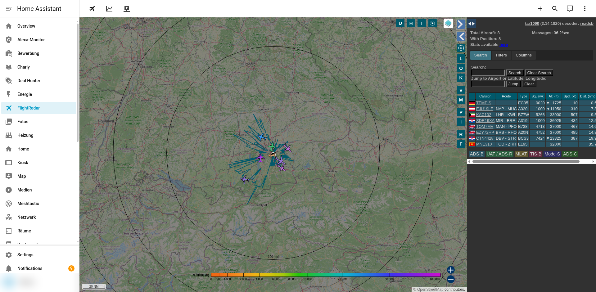
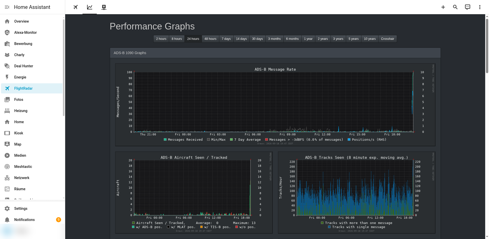
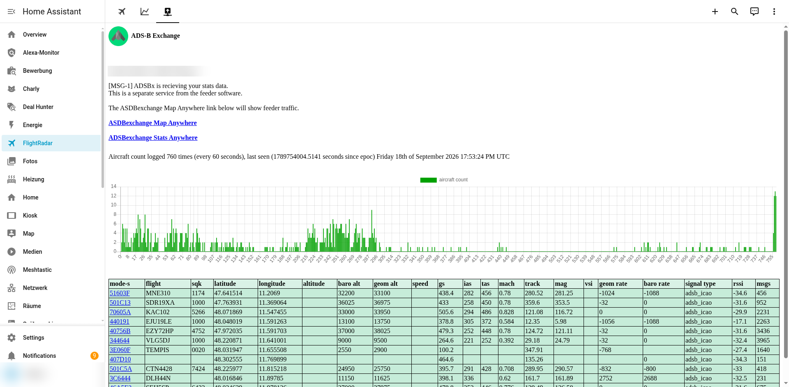
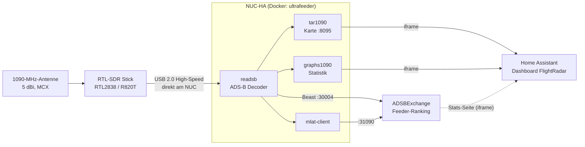

# IceFlightRadar

Eigener ADS-B-Flugradar auf dem Home-Assistant-NUC: Ein RTL-SDR-Stick empfängt die 1090-MHz-Transponder-Signale der Flugzeuge, `readsb` dekodiert sie, `tar1090` zeigt sie als interaktive Radar-Karte (Positionen, Rufzeichen, Höhe, Speed, Routen, Trails) und alles ist als Dashboard **FlightRadar** in Home Assistant eingebettet. Optional werden die Daten an ADSBExchange gefeedet.

## Screenshots

**Karte** - Live-Flugzeuge mit Route, Typ, Höhe und Speed, Range-Ringe und Reichweiten-Umrandung (Home Assistant Tab "Karte"):



**Statistik** - Empfänger-Graphen (Nachrichtenrate, Aircraft Seen/Tracked, Range, Signalpegel) via graphs1090:



**ADSBExchange** - Live-Ansicht dessen, was der Feed bei ADSBExchange ankommt (Feeder-ID im Screenshot verwischt):



> Die Karte ist bewusst grob gezoomt und die Standort-Koordinaten stehen nur in der lokalen `.env`, nicht im Repo.

## Architektur



Als Decoder kommt nicht das originale `antirez/dump1090` zum Einsatz (seit Jahren unmaintained, nur Basis-Karte), sondern dessen aktiver Nachfolger `readsb` samt `tar1090` im All-in-one-Image [`docker-adsb-ultrafeeder`](https://github.com/sdr-enthusiasts/docker-adsb-ultrafeeder).

## Hardware

| Teil | Details |
|---|---|
| SDR | RTL2838-Stick mit R820T-Tuner (getestet: NooElec NESDR Nano 3 und ein generischer RTL2838UHIDIR) |
| Antenne | dedizierte **1090-MHz-Antenne**, 5 dBi, Magnetfuß, RG174 1 m, MCX-Stecker (Adapter SMA-Stecker auf MCX-Buchse liegt bei) |
| Anschluss | Stick **direkt** in einen USB-3-Port des NUC, keine USB-Verlängerung (siehe Lessons Learned) |

## Installation

```bash
# 1. DVB-T-Kernel-Treiber sperren, sonst blockiert er den SDR-Zugriff
sudo cp modprobe/blacklist-rtlsdr-dvb.conf /etc/modprobe.d/
sudo rmmod dvb_usb_rtl28xxu rtl2832_sdr rtl2832 2>/dev/null

# 2. Konfiguration
cp .env.example .env        # Koordinaten, Seriennummer (rtl_test), ADSBX-UUID (uuidgen) eintragen

# 3. Starten
docker compose up -d
```

Die Karte ist danach unter `http://<NUC>:8095/` erreichbar, die Statistik unter `http://<NUC>:8095/graphs1090/`.

### Home-Assistant-Dashboard

1. `dashboards/flightradar.yaml` nach `/config/dashboards/` kopieren.
2. In `configuration.yaml` unter `lovelace: dashboards:` eintragen:

   ```yaml
   lovelace-flightradar:
     mode: yaml
     title: FlightRadar
     icon: mdi:airplane
     show_in_sidebar: true
     filename: dashboards/flightradar.yaml
   ```

3. `DEINE_FEED_ID` im dritten Tab ersetzen (steht nach dem ersten Connect in `docker logs iceflightradar-ultrafeeder | grep "Stats URL"`) und Home Assistant neu starten. Ein neuer Dashboard-Eintrag in der `configuration.yaml` braucht einen Core-Neustart, Änderungen an der Dashboard-YAML selbst werden live übernommen.

### ADSBExchange-Feed

Die Feed-Zeilen stehen bereits in der `docker-compose.yml` (`ULTRAFEEDER_CONFIG`). Wichtig:

- Die Stations-UUID einmalig mit `uuidgen` erzeugen und danach **nicht mehr ändern**, sonst gilt die Station als neu.
- Für MLAT braucht das `mlat-client`-Skript zusätzlich die **globale** Variable `UUID`, die `uuid=` in der Config-Zeile allein reicht nicht (Fehlermeldung `either UUID or MLAT_USER must be defined`).
- Erfolgskontrolle: `docker logs iceflightradar-ultrafeeder | grep -iE "adsbexchange|mlat-client"` zeigt `Connection established: feed.adsbexchange.com` und den MLAT-Handshake.

## Ergebnis der Antennen-Optimierung

Mit der mitgelieferten Stummelantenne war der Empfang schwach, mit der dedizierten 1090-MHz-Antenne deutlich besser (Werte aus `readsb` `stats.json`, `last1min`):

| | Stock-Antenne | 5-dBi-1090-MHz-Antenne |
|---|---|---|
| Valide Nachrichten pro Minute | ca. 360 | **3401** |
| Flugzeuge mit Position | 0 bis 1 | **8 von 10** |
| Positionsfixes pro Minute | ca. 17 | **283** |
| Rauschpegel | -19 dB | **-39 dB** |

## Reichweiten-Umrandung und Flugspuren

Die Karte kennt zwei Arten von Linien, die sich in Farbe und Zweck unterscheiden:

| Linie | Bedeutung | Einstellung |
|---|---|---|
| **Petrol-farbene Strahlen** vom Empfänger nach außen | Reichweiten-Umrandung ("actual range outline"): pro Himmelsrichtung der am weitesten entfernte Empfangspunkt. Sie ist ein Sammelwert über alle Flüge, keine einzelne Flugroute. | `READSB_RANGE_OUTLINE_HOURS=0.0833` = nur die letzten **5 Minuten** (Standard wären 24 h). Ohne aktive Flüge verschwindet sie damit von selbst. |
| **Farbige Spur hinter jedem Flugzeug** (nach Höhe eingefärbt) | Verlauf des einzelnen Fluges aus den bisherigen Positionen | `tempTrails = true; tempTrailsTimeout = 300` zeigt die Spuren aller Flugzeuge dauerhaft an und lässt Spurpunkte nach 300 s verfallen |

Ein Flugzeug, von dem kein Signal mehr kommt, bleibt mit seiner Spur noch bis zu **5 Minuten** stehen (`seenTimeout = 300`) und verschwindet dann samt Linie. Das läuft im Browser: `readsb` selbst nimmt Flugzeuge nach ca. 60 s aus seinem JSON-Feed, `tar1090` behält sie danach lokal bis zum Ablauf des Timeouts.

Die Werte werden in der `docker-compose.yml` gesetzt, der Ausdruck für `config.js` kommt über `TAR1090_CONFIGJS_APPEND`. Alte Umrandungs-Daten lassen sich bei Bedarf zurücksetzen, indem man den Container stoppt, `globe_history/outline.json` und `globe_history/internal_state/rangeDirs.gz` löscht und ihn wieder startet.

## Lessons Learned

- **Nie den USB-Stick verlängern, sondern die Antenne per Koax.** Über ein USB-Verlängerungskabel fiel der Stick auf USB Full-Speed (12 Mbit/s) zurück, im Kernel-Log erschien alle zwei Minuten `usb ...: reset full-speed USB device`. Der RTL-SDR braucht High-Speed für seine ca. 2,4 MSps, Ergebnis war 0 empfangene Nachrichten.
- **`rtl_adsb`-Rohzahlen sind kein Qualitätsmaß.** `rtl_adsb` zählt Frames ohne CRC-Prüfung. Ein Stick mit falscher WLAN-Antenne zeigte dort 3x mehr Treffer, im echten Decoder kamen aber nur wenige valide Nachrichten und 0 Flugzeuge an (überwiegend Rauschen). Für Vergleiche immer die validierten Werte aus `docker exec iceflightradar-ultrafeeder cat /run/readsb/stats.json` verwenden.
- **Der `messages`-Zähler in `aircraft.json` startet bei jedem Container-Neustart bei 0.** Kurz nach einem Neustart wirkt der Empfang deshalb fälschlich tot.
- **Beim Umstecken eines Sticks** kann `readsb` mit `unable to read device details` abstürzen (Stick ist noch beim Enumerieren). Ein `docker compose restart` nach dem Stecken behebt das.
- **Mehrere Sticks mit Werks-Seriennummer `00000001`** lassen sich nicht unterscheiden. Bei mehr als einem Stick vorher mit `rtl_eeprom -s` eindeutige Seriennummern schreiben.
- **Standort in Home Assistant:** Wenn `configuration.yaml` Breite/Länge per `!secret` festlegt, überschreibt sie bei jedem Core-Neustart eine per UI oder WebSocket-API geänderte Position. Dauerhaft ändern geht nur in der `secrets.yaml`.
- **Panel-Views** in Home-Assistant-Dashboards zeigen nur die erste Karte, dafür aber in voller Breite. Mehrere Karten in einer schmalen Spalte ließen die graphs1090-Seite viel zu schmal wirken, daher ein Tab pro iframe.

## Dateien

| Datei | Zweck |
|---|---|
| `docker-compose.yml` | Ultrafeeder-Stack (readsb, tar1090, graphs1090, ADSBX-Feed), Werte kommen aus `.env` |
| `.env.example` | Vorlage für Standort, SDR-Seriennummer und ADSBX-UUID |
| `dashboards/flightradar.yaml` | Home-Assistant-Dashboard mit den drei Tabs |
| `modprobe/blacklist-rtlsdr-dvb.conf` | sperrt die DVB-T-Kernel-Treiber |
| `docs/images/` | Screenshots aus Home Assistant |

## Datenschutz

Standort-Koordinaten, ADSBX-UUID und Feeder-ID gehören nicht ins Repo, sie stehen nur in der lokalen `.env` bzw. werden beim Einrichten eingesetzt.
