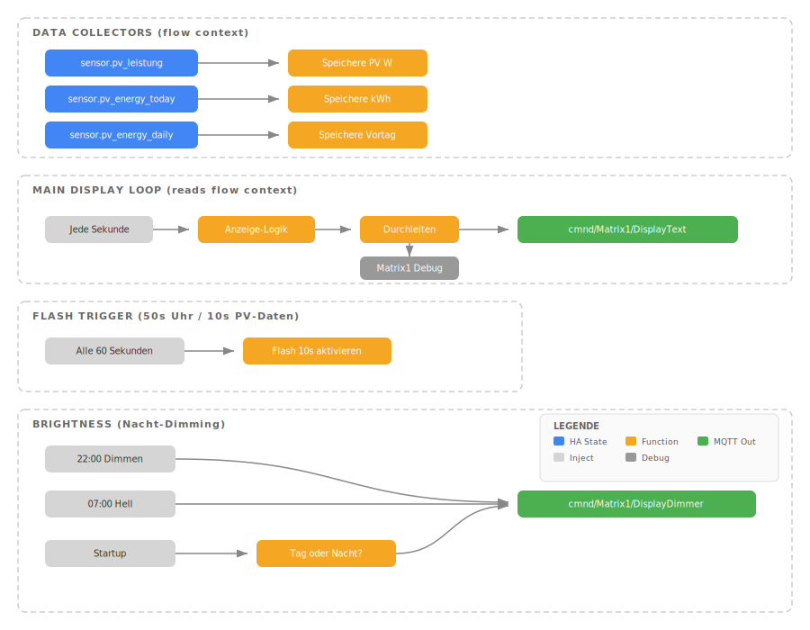

# MAX7219 LED Matrix Displays - Uhr, PV-Anzeige & Benachrichtigungen

ESP8266 + MAX7219 LED-Matrix Displays als Uhrzeit-, PV-Leistungs- und Benachrichtigungsanzeige, gesteuert über Tasmota, MQTT und Node-RED in Home Assistant.

## Inhalt

- [Übersicht](#übersicht)
- [Hardware](#hardware)
- [Tasmota Firmware](#tasmota-firmware)
- [Tasmota Konfiguration](#tasmota-konfiguration)
- [Home Assistant Integration](#home-assistant-integration)
- [Node-RED Flows](#node-red-flows)
- [Anzeige-Logik](#anzeige-logik)
- [Nachbau-Anleitung](#nachbau-anleitung)
- [Troubleshooting](#troubleshooting)

## Übersicht

Drei ESP8266-basierte LED-Matrix-Displays mit unterschiedlichen Funktionen:

| Display | Module | Standort | Funktion |
|---|---|---|---|
| **Matrix1** | 4 (32x8) | PV-Schuppen | 50s PV-Daten, 10s Uhrzeit |
| **Matrix2** | 4 (32x8) | Innenraum | 50s Uhrzeit, 10s PV-Daten |
| **Matrix3** | 8 (64x8) | Innenraum | Links: Uhr+PV, Rechts: HA-Benachrichtigungen |

## Hardware

### Gemeinsame Komponenten

| Komponente | Details |
|---|---|
| **Mikrocontroller** | ESP8266MOD 12-F |
| **Display** | MAX7219 LED-Matrix 8x8 Module |
| **Firmware** | Tasmota (siehe [Firmware-Abschnitt](#tasmota-firmware)) |
| **Stromversorgung** | USB 5V |

### Pinbelegung pro Display

| Display | DIN (Data) | CS (Chip Select) | CLK (Clock) |
|---|---|---|---|
| **Matrix1** | D7 (GPIO13) | D3 (GPIO0) | D5 (GPIO14) |
| **Matrix2** | D2 (GPIO4) | D1 (GPIO5) | D0 (GPIO16) |
| **Matrix3** | D7 (GPIO13) | D3 (GPIO0) | D5 (GPIO14) |

Zusätzlich: VCC → 5V/VIN, GND → GND

### Schaltplan (Matrix1 / Matrix3)

```
ESP8266MOD 12-F          MAX7219 Matrix
┌──────────────┐         ┌──────────────────┐
│           D7 ├────────►│ DIN              │
│           D3 ├────────►│ CS               │
│           D5 ├────────►│ CLK              │
│          VIN ├────────►│ VCC (5V)         │
│          GND ├────────►│ GND              │
└──────────────┘         └──────────────────┘
       │
       └── USB 5V Stromversorgung
```

### Schaltplan (Matrix2)

```
ESP8266MOD 12-F          MAX7219 32x8 Matrix
┌──────────────┐         ┌──────────────────┐
│           D2 ├────────►│ DIN              │
│           D1 ├────────►│ CS               │
│           D0 ├────────►│ CLK              │
│          VIN ├────────►│ VCC (5V)         │
│          GND ├────────►│ GND              │
└──────────────┘         └──────────────────┘
       │
       └── USB 5V Stromversorgung
```

## Tasmota Firmware

### Matrix1 & Matrix2 (32x8, 4 Module)

Die vorgefertigte `tasmota-display.bin` von [Tasmota Web Installer](https://tasmota.github.io/install/) oder ein TasmoCompiler-Build reicht aus. Der Dot-Matrix-Treiber (`DisplayModel 19`) ist in den meisten Display-Builds enthalten.

### Matrix3 (64x8, 8 Module) - Custom Build erforderlich

**Problem:** Die offizielle `tasmota-display.bin` (Release-Build) enthält den MAX7219 **Dot-Matrix-Treiber** (`USE_DISPLAY_MAX7219_MATRIX`, DisplayModel 19) **nicht**. Nur der 7-Segment-Treiber (`USE_DISPLAY_MAX7219`, DisplayModel 15) ist enthalten. `DisplayModel 19` wird beim Setzen ignoriert und bleibt auf 0.

**Lösung:** Tasmota muss selbst kompiliert werden mit aktiviertem Dot-Matrix-Treiber.

#### Custom Build mit PlatformIO

##### Voraussetzungen

```bash
pip install platformio
```

##### Schritt 1: Tasmota Quellcode klonen

```bash
git clone --depth 1 https://github.com/arendst/Tasmota.git
cd Tasmota
```

##### Schritt 2: Dot-Matrix-Treiber aktivieren

Die Datei `tasmota/include/tasmota_configurations.h` editieren. Im Block `#ifdef FIRMWARE_DISPLAYS` den Matrix-Treiber hinzufügen:

```c
// Suche diese Stelle (ca. Zeile 360):
#define USE_DISPLAY                              // Add Display Support (+2k code)
  #define USE_DISPLAY_TM1637                     // [DisplayModel 15] Enable TM1637 module
  #define USE_DISPLAY_MAX7219                    // [DisplayModel 15] Enable MAX7219 7-segment module

// Füge diese Zeile direkt darunter hinzu:
  #define USE_DISPLAY_MAX7219_MATRIX             // [DisplayModel 19] Enable MAX7219 8x8 Matrix Display
```

**Wichtig:** `USE_DISPLAY_MAX7219_MATRIX` deaktiviert automatisch `USE_DISPLAY_MAX7219` und `USE_DISPLAY_TM1637` (gegenseitiger Ausschluss in `tasmota_template.h`). Dot-Matrix und 7-Segment können nicht gleichzeitig aktiv sein.

##### Schritt 3: Kompilieren

```bash
pio run -e tasmota-display
```

Die Firmware liegt anschließend unter:
```
.pio/build/tasmota-display/firmware.bin
```

Ergebnis: ~626 KB, passt auf ESP8266 mit 4MB Flash.

##### Schritt 4: Flashen via esptool

```bash
# Flash komplett löschen
esptool --port /dev/ttyUSB0 erase-flash

# Custom Firmware flashen
esptool --port /dev/ttyUSB0 write-flash -fs detect -fm dout 0x0 .pio/build/tasmota-display/firmware.bin
```

**Hinweis:** Nach `erase-flash` sind alle Tasmota-Einstellungen gelöscht und müssen neu konfiguriert werden.

##### Warum nicht OTA?

OTA-Updates schlagen mit "Not enough space" fehl, wenn die neue Firmware gleich groß oder größer als die vorhandene ist. Bei einem frischen Flash über Serial (`erase-flash` + `write-flash`) gibt es dieses Problem nicht.

#### GPIO-Zuordnung: MAX7219-Pins vs. SSPI-Pins

| Tasmota-Version | GPIO-Typ | Treiber |
|---|---|---|
| < 15.x (ältere Builds) | SSPI MOSI / SSPI SCLK / SSPI CS | Beide (Model 15 + 19) |
| 15.x+ (mit Custom Build) | MAX7219 DIN / MAX7219 CLK / MAX7219 CS | Nur Dot-Matrix (Model 19) |

Für den Custom Build **müssen** die dedizierten MAX7219-GPIO-Typen verwendet werden (nicht SSPI). Die Tasmota Template-Werte sind:

| GPIO-Funktion | Template-Wert |
|---|---|
| MAX7219 DIN | 6944 |
| MAX7219 CLK | 6912 |
| MAX7219 CS | 6976 |

## Tasmota Konfiguration

### Konfiguration via HTTP (nach WiFi-Verbindung)

Sobald der ESP im WLAN ist (`http://<ESP_IP>`), können alle Befehle über die Web-Konsole oder HTTP-API gesendet werden:

```
http://<ESP_IP>/cm?cmnd=<BEFEHL>
```

### Matrix1 / Matrix2 (32x8)

```
Backlog SSID1 <WLAN_SSID>; Password1 <WLAN_PASSWORT>
Backlog MqttHost <BROKER_IP>; MqttPort 1883; MqttUser <MQTT_USER>; MqttPassword <MQTT_PASSWORT>
Backlog Topic Matrix1; FriendlyName1 Matrix1
Backlog DisplayModel 19; DisplayWidth 32; DisplayHeight 8; DisplayMode 0; DisplayDimmer 5
Backlog Timezone 99; TimeDST 0,0,3,1,2,120; TimeSTD 0,0,10,1,3,60
SetOption114 1
```

### Matrix3 (64x8, Custom Build)

```
Backlog SSID1 <WLAN_SSID>; Password1 <WLAN_PASSWORT>
Backlog MqttHost <BROKER_IP>; MqttPort 1883; MqttUser <MQTT_USER>; MqttPassword <MQTT_PASSWORT>
Backlog Topic Matrix3; FriendlyName1 Matrix3

# Template: MAX7219 DIN=GPIO13, MAX7219 CLK=GPIO14, MAX7219 CS=GPIO0
Template {"NAME":"Matrix3","GPIO":[6976,0,0,0,0,0,0,0,0,6944,6912,0,0,0],"FLAG":0,"BASE":18}
Module 0

# Display: 64 Pixel breit (8 Module), 8 Pixel hoch
Backlog DisplayModel 19; DisplayWidth 64; DisplayHeight 8; DisplayMode 0; DisplayDimmer 5
Backlog Timezone 99; TimeDST 0,0,3,1,2,120; TimeSTD 0,0,10,1,3,60
SetOption114 1
Restart 1
```

### Wichtige Tasmota-Befehle

| Befehl | Beschreibung |
|---|---|
| `DisplayText <text>` | Text auf Matrix anzeigen |
| `DisplayDimmer <0-15>` | Helligkeit (0=aus, 15=max) |
| `DisplayMode 0` | Textmodus |
| `DisplayModel` | Aktuelles Display-Modell abfragen |
| `Status 0` | Vollständiger Status |
| `Status 5` | Netzwerk-Status (IP etc.) |
| `Status 6` | MQTT-Verbindungsinfo |

## Home Assistant Integration

### MQTT Auto-Discovery

Tasmota-Geräte werden über `SetOption114 1` automatisch in Home Assistant erkannt.

### MQTT Topics

| Topic | Richtung | Beschreibung |
|---|---|---|
| `cmnd/Matrix{1,2,3}/DisplayText` | → ESP | Text auf Display senden |
| `cmnd/Matrix{1,2,3}/DisplayDimmer` | → ESP | Helligkeit setzen (0-15) |
| `cmnd/Matrix{1,2,3}/POWER` | → ESP | Display ein/ausschalten |
| `stat/Matrix{1,2,3}/RESULT` | ← ESP | Bestätigung von Befehlen |
| `tele/Matrix{1,2,3}/LWT` | ← ESP | Online/Offline Status |

### Matrix3 Benachrichtigungen (HA Package)

Für Matrix3 wird ein HA-Package mit `input_boolean` Helfern verwendet, um Benachrichtigungsquellen ein-/auszuschalten:

**Datei:** `packages/matrix3_notifications.yaml`

```yaml
input_boolean:
  # KRITISCH (Prio 1)
  matrix3_thw_alarm:
    name: "Matrix3: THW Alarm"
    icon: mdi:fire-truck
    initial: true
  matrix3_internet_offline:
    name: "Matrix3: Internet Offline"
    icon: mdi:web-off
    initial: true

  # HOCH (Prio 2)
  matrix3_nina_warnung:
    name: "Matrix3: NINA Warnung"
    icon: mdi:alert-octagon
    initial: true
  matrix3_dwd_wetter:
    name: "Matrix3: DWD Unwetter"
    icon: mdi:weather-lightning-rainy
    initial: true
  matrix3_hochwasser:
    name: "Matrix3: Hochwasser"
    icon: mdi:waves
    initial: true
  matrix3_thw_rueckmeldung:
    name: "Matrix3: THW Rückmeldung"
    icon: mdi:calendar-alert
    initial: true
  matrix3_netzwerk:
    name: "Matrix3: Netzwerk-Fehler"
    icon: mdi:lan-disconnect
    initial: true

  # MITTEL (Prio 3)
  matrix3_petkit:
    name: "Matrix3: Petkit Fehler"
    icon: mdi:cat
    initial: true
  matrix3_meshtastic:
    name: "Matrix3: Meshtastic Nachricht"
    icon: mdi:radio-tower
    initial: true
  matrix3_mesh_batterie:
    name: "Matrix3: Mesh Batterie niedrig"
    icon: mdi:battery-alert
    initial: true
  matrix3_waschmaschine:
    name: "Matrix3: Waschmaschine wartet"
    icon: mdi:washing-machine
    initial: false
  matrix3_trockner:
    name: "Matrix3: Trockner wartet"
    icon: mdi:tumble-dryer
    initial: false

  # NIEDRIG (Prio 4)
  matrix3_tibber_guenstig:
    name: "Matrix3: Tibber günstig"
    icon: mdi:cash-check
    initial: false
  matrix3_tibber_teuer:
    name: "Matrix3: Tibber teuer"
    icon: mdi:cash-remove
    initial: false
```

Steuerung unter: **Einstellungen → Geräte & Dienste → Helfer**

## Node-RED Flows

### Flow-Diagramm (Matrix1/Matrix2)



### Benötigte Node-RED Nodes

- `node-red` (Standard: inject, function, delay, debug)
- `node-red-contrib-home-assistant-websocket` (HA Integration)
- MQTT Nodes (Standard in Node-RED)

### Flow-Architektur Matrix3

```
┌─────────────────────────────────────────────────────────────┐
│ DATA COLLECTORS (flow context)                              │
│  sensor.pv_leistung        → Speichere PV W                │
│  sensor.pv_energy_today    → Speichere kWh                  │
│  sensor.pv_energy_daily    → Speichere Vortag               │
└─────────────────────────────────────────────────────────────┘

┌─────────────────────────────────────────────────────────────┐
│ ALERT COLLECTOR (alle 5s)                                   │
│  Liest HA-States via global.get('homeassistant')            │
│  Prüft input_boolean Helfer → sammelt aktive Alerts         │
│  Sortiert nach Priorität → speichert in flow context        │
└─────────────────────────────────────────────────────────────┘

┌─────────────────────────────────────────────────────────────┐
│ MAIN DISPLAY LOOP (jede Sekunde)                            │
│  Jede Sekunde → Display-Logik → cmnd/Matrix3/DisplayText    │
│                                                             │
│  Links (5 Zeichen): Uhrzeit HH:MM / PV-Daten               │
│  Leerzeichen (1 Zeichen): Trenner                           │
│  Rechts (4 Zeichen): Alert (rotiert alle 3s)                │
│                                                             │
│  Gesamt max. 10 Zeichen = 60px (Display: 64px)              │
└─────────────────────────────────────────────────────────────┘

┌─────────────────────────────────────────────────────────────┐
│ FLASH TRIGGER (50s Uhr / 10s PV)                            │
│  Alle 60 Sekunden → 10s PV-Flash aktivieren                 │
└─────────────────────────────────────────────────────────────┘

┌─────────────────────────────────────────────────────────────┐
│ BRIGHTNESS (Nacht-Dimming)                                  │
│  22:00 → Dimmer 1 | 07:00 → Dimmer 5 | Startup → prüfen   │
└─────────────────────────────────────────────────────────────┘
```

### Flow-Variablen (Flow Context)

| Variable | Typ | Display | Beschreibung |
|---|---|---|---|
| `m{1,2,3}_pv_watts` | number | Alle | Aktuelle PV-Leistung in Watt |
| `m{1,2,3}_daily_kwh` | number | Alle | PV-Tagesertrag in kWh |
| `m{1,2,3}_yesterday_kwh` | number | Alle | PV-Ertrag Vortag in kWh |
| `m{1,2,3}_show_pv_until` | timestamp | M2, M3 | Ende des PV-Flash-Zeitfensters |
| `m1_show_time_until` | timestamp | M1 | Ende des Uhr-Flash-Zeitfensters |
| `m3_alerts` | array | M3 | Aktive Alert-Strings |

## Anzeige-Logik

### Matrix2 (Uhr-Modus, Innenraum)

```
60-Sekunden-Zyklus:
├── 50 Sekunden: Uhrzeit HH:MM (blinkender Doppelpunkt)
└── 10 Sekunden: PV-Daten
```

### Matrix1 (PV-Modus, Schuppen)

```
60-Sekunden-Zyklus:
├── 50 Sekunden: PV-Daten
└── 10 Sekunden: Uhrzeit HH:MM
```

### Matrix3 (Dual-Anzeige, 64x8)

```
Linke 4 Module (32px):          Rechte 4 Module (32px):
┌───────────────────┐           ┌───────────────────┐
│ 50s Uhrzeit HH:MM │           │ Alert (rotiert     │
│ 10s PV-Daten       │           │ alle 3 Sekunden)   │
└───────────────────┘           └───────────────────┘
```

### PV-Anzeige Modi (alle Displays)

| Bedingung | Anzeige | Format | Beispiel |
|---|---|---|---|
| PV >= 15W | Aktuelle Leistung | `<Watt>W` | `420W` |
| PV < 15W, Tagesertrag > 0 | Tagesertrag | `<kWh>kW` | `3.2kW` |
| PV < 15W, Tagesertrag ~ 0 | Vortags-Ertrag | `<kWh>kW` | `1.3kW` |

### Matrix3 Alert-Codes (max. 4 Zeichen)

| Prio | Alert | Code | Quelle |
|---|---|---|---|
| 1 | THW Alarm | `ALM!` | `binary_sensor.divera_alarm_aktiv` |
| 1 | Internet offline | `NNET` | `binary_sensor.fritz_box_*_connection` |
| 2 | NINA Warnung | 4 Z. | `sensor.nina_*_warnungen_anzahl` |
| 2 | DWD Unwetter | `UNWT` | `sensor.dwd_*_warnungen` |
| 2 | Hochwasser | `HCHW` | `sensor.pegel_*` (> 600cm) |
| 2 | THW Rückmeldung | `THW!` | `binary_sensor.divera_ruckmeldung_fallig` |
| 2 | Netzwerk-Fehler | `NETZ` | `sensor.netzwerk_status` |
| 3 | Petkit Fehler | `KATZ` | `sensor.petkit_status` |
| 3 | Meshtastic Msg | `MESH` | `sensor.mesh_letzte_nachricht` (< 30min) |
| 3 | Mesh Batterie | `B15` | `sensor.mesh_*_battery` (< 20%) |
| 3 | Waschmaschine | `WSCH` | `input_boolean.waschmaschine_warten` |
| 3 | Trockner | `TRCK` | `input_boolean.trockner_warten` |
| 4 | Tibber teuer | `TEUR` | `sensor.tibber_price_level` = VERY_EXPENSIVE |
| 4 | Tibber günstig | `BIL!` | `sensor.tibber_price_level` = VERY_CHEAP |

### Helligkeitssteuerung (alle Displays)

| Zeitraum | Helligkeit | DisplayDimmer |
|---|---|---|
| 07:00 - 22:00 | 33% | 5 |
| 22:00 - 07:00 | ~7% | 1 |

### Display-Zeichenlimit

| Display | Pixel | Max. Zeichen | Font |
|---|---|---|---|
| Matrix1 / Matrix2 | 32px | 5 | Fixed 6px/Zeichen |
| Matrix3 | 64px | 10 | Fixed 6px/Zeichen |

Bei mehr Zeichen scrollt der Text automatisch. Für Matrix3 bedeutet das: links 5 Zeichen (Uhr/PV) + 1 Leerzeichen + rechts max. 4 Zeichen (Alert) = 10 Zeichen.

### Datenquellen (Home Assistant Sensoren)

| Sensor | Beschreibung |
|---|---|
| `sensor.pv_leistung` | Aktuelle PV-Leistung (Tasmota ENERGY) |
| `sensor.pv_energy_today` | Tagesertrag in kWh (Template Sensor) |
| `sensor.pv_energy_daily` | Utility Meter mit `last_period` Attribut für Vortag |

## Nachbau-Anleitung

### Voraussetzungen

- Home Assistant mit MQTT (Mosquitto) Addon
- Node-RED Addon installiert
- `node-red-contrib-home-assistant-websocket` in Node-RED installiert
- PV-System mit Leistungssensor (oder anderen Sensor anpassen)
- WLAN im Empfangsbereich des ESP
- Für Matrix3: PlatformIO (`pip install platformio`)

### Schritt-für-Schritt

1. **Hardware zusammenbauen**
   - ESP8266 mit MAX7219 verkabeln (siehe Schaltpläne oben)
   - Bei 8 Modulen: OUT-Pins des 4. Moduls mit IN-Pins des 5. verbinden

2. **Tasmota flashen**
   - Matrix1/Matrix2: [Tasmota Web Installer](https://tasmota.github.io/install/) mit Display-Build
   - Matrix3: Custom Build (siehe [Firmware-Abschnitt](#matrix3-64x8-8-module---custom-build-erforderlich))
   - Flash via `esptool`: `esptool --port /dev/ttyUSB0 write-flash -fs detect -fm dout 0x0 firmware.bin`

3. **ESP konfigurieren**
   - Via Serial (115200 Baud) oder Tasmota Web-UI
   - WiFi, MQTT, Display-Parameter konfigurieren
   - Für Matrix3: Template mit MAX7219-GPIO-Pins setzen
   - Nach WiFi-Verbindung: Web-UI unter `http://<ESP_IP>` erreichbar

4. **Node-RED Flow importieren**
   - MQTT-Broker-Node auf eigenen Mosquitto anpassen
   - HA-Server-Node auf eigene Instanz anpassen
   - Sensor-Entity-IDs an eigene PV-Sensoren anpassen

5. **HA Konfiguration laden** (nur Matrix3)
   - `packages/matrix3_notifications.yaml` in HA-Config ablegen
   - Entwicklerwerkzeuge → YAML → Input Booleans neu laden

6. **Testen**
   - `DisplayText Hallo` via Tasmota-Konsole
   - Flow deployen, Display sollte Uhrzeit/PV anzeigen

## Troubleshooting

### Display zeigt nichts an

1. **Tasmota erreichbar?** → `http://<ESP_IP>` im Browser aufrufen
2. **MQTT verbunden?** → Tasmota Konsole: `Status 6` prüfen
3. **Display-Treiber geladen?** → Boot-Log: `MTX: MAX7291Matrix_initDriver`
4. **DisplayModel prüfen:** → `DisplayModel` muss 19 zurückgeben
5. **Test:** Tasmota Konsole: `DisplayText Hallo`

### DisplayModel 19 wird nicht akzeptiert (bleibt 0 oder 15)

- **Model 0:** Dot-Matrix-Treiber nicht kompiliert → Custom Build mit `USE_DISPLAY_MAX7219_MATRIX` nötig
- **Model 15:** 7-Segment-Treiber aktiv statt Dot-Matrix → Custom Build nötig (siehe oben)
- Bei Custom Build: `USE_DISPLAY_MAX7219_MATRIX` in `tasmota_configurations.h` im `FIRMWARE_DISPLAYS`-Block hinzufügen
- GPIO-Typ muss "MAX7219 DIN/CLK/CS" sein, nicht "SSPI MOSI/SCLK/CS"

### Text scrollt / ist zu lang

- 32x8 Matrix: max. 5 Zeichen (Font: 6px pro Zeichen, 5×6=30px < 32px)
- 64x8 Matrix: max. 10 Zeichen (10×6=60px < 64px)
- `HH:MM` passt auf 32px, `HH:MM:SS` scrollt
- `[x0]` und `[x33]` Positionsbefehle werden vom MAX7219-Matrix-Treiber **nicht** unterstützt und als Text dargestellt

### ESP verbindet sich nicht mit WLAN

- SSID und Passwort prüfen: `Status 3` in Tasmota Konsole
- Sonderzeichen im SSID werden escaped angezeigt (z.B. `Bad\!IoT`)
- ESP8266 unterstützt nur 2.4 GHz WLAN

### Node-RED sendet keine Daten

1. MQTT-Broker-Node in Node-RED prüfen (verbunden?)
2. HA-Server-Node prüfen (verbunden?)
3. Debug-Node aktivieren
4. MQTT manuell testen: `mosquitto_pub -h <BROKER_IP> -t "cmnd/Matrix1/DisplayText" -m "Test"`

### OTA-Update schlägt fehl ("Not enough space")

- ESP8266 mit 4MB Flash hat nicht genug Platz für gleichzeitig alte + neue Firmware
- Lösung: Via Serial flashen (`esptool erase-flash` + `write-flash`)
- Alternativ: Erst `tasmota-minimal.bin` via OTA, dann die volle Firmware

---

Erstellt: Februar 2026
Projekt: [IceHomeAssist](https://github.com/icepaule/IceHomeAssist)
